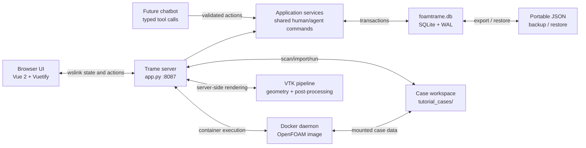

<p align="center">
  
</p>

<h1 align="center">FOAMTrame</h1>

<p align="center">
  A responsive, browser-based OpenFOAM workspace built with
  <a href="https://kitware.github.io/trame/">Trame</a>,
  <a href="https://vtk.org/">VTK</a>, and
  <a href="https://www.docker.com/">Docker</a>.
</p>

<p align="center">
  <a href="https://www.python.org/downloads/"></a>
  <a href="https://kitware.github.io/trame/"></a>
  <a href="https://www.docker.com/"></a>
  <a href="#offline-installation"></a>
  <a href="./LICENSE"></a>
</p>

FOAMTrame brings case selection, tutorial import, OpenFOAM command execution, live logs, run history, plots, and VTK post-processing into one glass-styled web interface. OpenFOAM operations run through a configured Docker image, while VTK rendering and data processing remain server-side.

## Table of contents

- [Features](#features)
- [Application workflow](#application-workflow)
- [Architecture](#architecture)
- [Requirements](#requirements)
- [Installation](#installation)
- [Running FOAMTrame](#running-foamtrame)
- [Using the application](#using-the-application)
- [App-state persistence](#app-state-persistence)
- [Backup and restore](#backup-and-restore)
- [Supported datasets](#supported-datasets)
- [Optional Flask API](#optional-flask-api)
- [Project structure](#project-structure)
- [Caching and performance](#caching-and-performance)
- [Development checks](#development-checks)
- [Troubleshooting](#troubleshooting)
- [Security notes](#security-notes)
- [License](#license)

## Features

### Setup and case management

- Verifies the Trame server, Docker daemon, and configured OpenFOAM image.
- Detects `WM_PROJECT_VERSION` from the configured Docker image and displays it
  in the footer, with an explicitly labelled configured-version fallback when
  the container runtime cannot be inspected.
- Scans a configurable case-root directory and restores the last active case.
- Creates a blank OpenFOAM case with `0`, `constant`, and `system` directories.
- Discovers official tutorials inside the Docker image.
- Provides searchable tutorial browsing and imports a selected tutorial into the local workspace.
- Disables active-case selection with a clear empty state when no cases exist.

Implementation: [tabs/setup_tab.py](./tabs/setup_tab.py)

### Geometry

- Loads the newest supported geometry or VTK file found in the active case.
- Accepts browser uploads for moderate-sized datasets.
- Displays dataset type, point count, and cell count.
- Uses server-side VTK rendering with camera reset and interactive controls.

Implementation: [tabs/geometry_tab.py](./tabs/geometry_tab.py)

### Meshing

- The Meshing navigation surface is currently reserved for future meshing tools.
- OpenFOAM meshing commands such as `blockMesh` are available from **Run/Log**.

Placeholder: [tabs/meshing_tab.py](./tabs/meshing_tab.py)

### Run and logs

- Detects logical and physical CPU counts.
- Configures process count and reports decomposition status.
- Scans the active case and configured Docker image to expose only validated
  application actions while keeping unavailable commands visible with their
  exact missing prerequisite.
- Prefers a case-provided `Allrun`; otherwise offers a reviewable guided sequence
  containing only confidently detected preprocessing, meshing, and solver steps.
- Derives the solver application and optional solver module from
  `system/controlDict` instead of assuming `simpleFoam` or `pimpleFoam`.
- Detects `surfaceFeatureExtract`, `blockMesh`, `snappyHexMesh`, `topoSet`,
  `setFields`, `decomposePar`, `reconstructPar`, and `foamToVTK` from their
  dictionaries, decomposition directories, result times, and Docker executables.
- Requires confirmation before `Allclean` and provides a separate safe-clean
  preview limited to detected time results, processor directories,
  `postProcessing`, `VTK`, and `log.*` files. The initial `0` directory and
  `constant/polyMesh` are preserved.
- Streams console output and supports stopping the active process.
- Accepts additional validated runs while a simulation is active, executes them
  one at a time in FIFO order, and allows waiting jobs to be cancelled or cleared.
  Each submission retains the case and runtime configuration selected when it was
  queued.
- Retains up to 100 indexed run-history records in the application database.

Implementation: [tabs/run_log_tab.py](./tabs/run_log_tab.py), the dependency-free
FIFO worker in [backend/simulation_queue.py](./backend/simulation_queue.py), and
the shared, fixed-ID action service in
[backend/case/capabilities.py](./backend/case/capabilities.py). UI controls and
future chatbot tools should resolve actions through this service rather than
submitting arbitrary shell strings.

### Plots

- Detects running simulations automatically, streams live updates, and serves
  completed results from the synchronized cache without a manual refresh.
- Selects scalar fields and renders scalar, velocity-magnitude, velocity-component,
  and residual charts.
- Switches between glass, white, black, and grey plot backgrounds with
  contrast-aware palettes.
- Supports Helvetica Neue-style (bundled TeX Gyre Heros), bundled Roboto, Times
  New Roman-style (bundled Liberation Serif), and Arial typography plus no logo,
  the FOAMFlask logo, or a custom image.
- Maximizes any plot while keeping the remaining charts available in a responsive
  sidebar.
- Exports each chart as a publication-friendly PNG with a consistent white paper
  background, regardless of the selected on-screen theme.
- Persists plot appearance and logo preferences in the unified app state so they
  participate in JSON backup and restore.

Implementation: [tabs/plots_tab.py](./tabs/plots_tab.py)

### Post-processing

- Reads VTK XML and legacy datasets plus common surface formats.
- Slices along the X, Y, or Z axis.
- Clips using plane, sphere, or box controls.
- Colours data using point or cell scalar arrays.
- Applies translation, rotation, and scale transforms.
- Shows adjustable translucent source context.
- Creates streamlines from available vector arrays.

Implementation: [tabs/visualizer_tab.py](./tabs/visualizer_tab.py) and
[backend/post/postprocessor.py](./backend/post/postprocessor.py)

### Settings

- Downloads case configuration, plot preferences, security preferences, and run
  history as one versioned JSON backup.
- Validates uploaded backups before enabling restore.
- Applies restored configuration and history transactionally to SQLite and the live Trame state.
- Provides disabled-by-default, opt-in network binding, CORS, response-header,
  request-size, WebSocket-size, and companion-API-key controls. The ordinary
  server listener remains loopback-only unless explicitly changed.

Implementation: [tabs/settings_tab.py](./tabs/settings_tab.py) and [app_state.py](./app_state.py). Database schema and transactions are implemented in [database.py](./database.py).

## Application workflow

1. Open **Setup** and wait for both health checks.
2. Select an existing case, create a blank case, or import an OpenFOAM tutorial.
3. Inspect available case geometry in **Geometry**.
4. Run meshing, solver, conversion, or case scripts from **Run/Log**.
5. Monitor solver data under **Plots**.
6. Inspect VTK results under **Post**.
7. Download periodic state backups from the gear-shaped **Settings** tab.

## Architecture



The primary entry point is [app.py](./app.py). It composes each tab under [tabs/](./tabs), connects backend managers under [backend/](./backend), and starts Trame on port `8087`.

### Database decision

FOAMTrame uses [SQLite](https://www.sqlite.org/) as its operational database. This is deliberate: the current application is local, single-process software, so an embedded database preserves simple installation and portable project state without requiring a database server, credentials, or another container. WAL mode, foreign keys, a busy timeout, and short-lived per-operation connections make background simulation-thread access predictable.

The database boundary lives in [database.py](./database.py), while [app_state.py](./app_state.py) retains the stable application-facing API. If FOAMTrame later becomes a hosted multi-user service or runs independent workers, that boundary should move to PostgreSQL rather than exposing SQL throughout the
UI and backend modules.

The planned chatbot should not automate browser clicks. Buttons and chatbot tools should invoke the same application-service commands. The `automation_actions` table is reserved for durable parameters, confirmation state, execution status, results, errors, and audit history; destructive or expensive commands can therefore require explicit confirmation before execution.

## Requirements

- [Docker Desktop](https://www.docker.com/products/docker-desktop/) or another
  reachable Docker daemon
- A modern browser with WebSocket support
- Enough memory for the selected VTK dataset and OpenFOAM container workload

Direct dependencies are declared in [pyproject.toml](./pyproject.toml), and the
complete cross-platform environment is reproducibly pinned in
[uv.lock](./uv.lock):

- Trame 3 and Trame-Vuetify 3
- VTK 9.3+
- Docker SDK for Python 7.1+
- Flask 3 and Flask-Compress
- Requests and psutil

## Installation

Clone or download the repository. The supported installers use `uv sync` to create
the project `.venv` from `uv.lock`, initialize SQLite, run machine-readable
diagnostics, and preserve any existing database or JSON migration data. A global
Python and `uv` installations are optional on Windows and Linux x86_64. The
platform installer first uses an existing CPython 3.12 interpreter when one is
available through PATH (or the Windows Python launcher). Otherwise, it verifies
and extracts bundled CPython 3.12.13. It then prefers a system `uv`, falling back
to the verified bundled `uv 0.10.12`. Both local runtimes live only in the ignored
`.foamtrame-tools/` directory, require no administrator privileges, and do not
modify PATH, the Windows registry, or existing Python installations.

### Windows PowerShell

```powershell
.\install.ps1
```

Install development/test dependencies as well:

```powershell
.\install.ps1 --dev
```

Choose a specific Trame port, or let the installer select a free one:

```powershell
.\install.ps1 --port 5087
.\install.ps1 --auto-port
```

Run a fully unattended installation with no console progress:

```powershell
.\install.ps1 --silent
# Unattended and automatically select a free port:
.\install.ps1 --silent --auto-port
```

### Linux

```bash
bash ./install.sh
# Include test tooling:
bash ./install.sh --dev
```

```bash
bash ./install.sh --port 5087
bash ./install.sh --auto-port
```

```bash
# Fully unattended; command output is recorded instead of printed:
bash ./install.sh --silent
bash ./install.sh --silent --auto-port
```

Both installers accept `--help`, `--dev`, `--skip-docker-check`, `--port`,
`--auto-port`, and `--silent` (also `--quiet` or `-q`). The shared implementation is
[install.py](./install.py), so Windows and Linux follow the same installation
logic.

When neither port option is supplied, the installer uses `8087`. It verifies
and reserves the selected port before creating the virtual environment or
installing packages. If `8087` (or an explicitly requested port) is unavailable,
installation stops with instructions to use `--port PORT` or `--auto-port`.
The successful selection is stored locally in `.foamtrame-port` and used by the
start scripts.

Silent mode is non-interactive: subprocess stdin and `uv` progress output are
disabled, and detailed command output is appended to
`logs/YYYYMMDD/install.log`. A successful silent install exits with code `0`
without console output. Failures return a nonzero code and print only the log
location. Silent mode does not weaken port validation: without a port option it
still requires `8087` to be free; use `--port PORT` or `--auto-port` when that is
unsuitable.

### Offline installation

The repository includes official compressed CPython and `uv` runtimes, published
checksums, and licenses for Windows x86_64 and Linux x86_64 (GNU libc). Therefore
an offline computer does not need Python or `uv` preinstalled. Compatible system
installations are preferred when available, while verified project-local copies
are installed automatically otherwise. Windows requires its built-in `tar`
utility; the standalone Python build also follows the standard CPython requirement
for the Microsoft Visual C++ runtime. Linux requires GNU libc 2.17 or newer,
`tar`, and either `sha256sum` or `shasum`.

Bundling Python and `uv` does not bundle VTK or the other packages referenced by
`uv.lock`. A first-time installation on a completely offline computer must also be
provided with those platform-specific packages, an already synchronized `.venv`,
or a populated `uv` cache. Docker-based OpenFOAM operations additionally require
Docker and the configured image to already be installed locally. Once these assets
are present, `start.ps1` and `start.sh` are independent of global Python and `uv`
installations.

### Automated silent-install examples

Invoke the Windows installer directly from deployment software without loading a
user profile or opening an interactive shell:

```powershell
# Windows PowerShell 5.1
powershell.exe -NoProfile -NonInteractive -ExecutionPolicy Bypass -File .\install.ps1 --silent --auto-port

# PowerShell 7+
pwsh -NoProfile -NonInteractive -File .\install.ps1 --silent --auto-port
```

Use the documented default port (`8087`) and fail if it is occupied:

```powershell
# Windows PowerShell
.\install.ps1 --silent
if ($LASTEXITCODE -ne 0) { exit $LASTEXITCODE }
```

```bash
# Linux shell
./install.sh --silent
```

Use a fixed deployment port:

```powershell
.\install.ps1 --silent --port 5087
if ($LASTEXITCODE -ne 0) { exit $LASTEXITCODE }
```

```bash
./install.sh --silent --port 5087
```

Automatically reserve a free port and read the selected value after installation:

```powershell
.\install.ps1 --silent --auto-port
if ($LASTEXITCODE -ne 0) { exit $LASTEXITCODE }

$FoamTramePort = (Get-Content -LiteralPath .\.foamtrame-port -Raw).Trim()
Write-Output "FOAMTrame installed on port $FoamTramePort"
```

```bash
./install.sh --silent --auto-port
FOAMTRAME_PORT="$(<.foamtrame-port)"
printf 'FOAMTrame installed on port %s\n' "$FOAMTRAME_PORT"
```

Surface the dated installer log when an unattended installation fails:

```powershell
.\install.ps1 --silent --auto-port
$InstallExitCode = $LASTEXITCODE
if ($InstallExitCode -ne 0) {
    $LogFile = Join-Path (Join-Path .\logs (Get-Date -Format yyyyMMdd)) install.log
    if (Test-Path -LiteralPath $LogFile) { Get-Content -LiteralPath $LogFile -Tail 100 }
    exit $InstallExitCode
}
```

```bash
if ! ./install.sh --silent --auto-port; then
  log_file="logs/$(date +%Y%m%d)/install.log"
  [[ -f "$log_file" ]] && tail -n 100 "$log_file"
  exit 1
fi
```

Example GitHub Actions steps:

```yaml
- name: Install FOAMTrame unattended
  shell: bash
  run: ./install.sh --silent --auto-port

- name: Publish selected port to later steps
  shell: bash
  run: echo "FOAMTRAME_PORT=$(cat .foamtrame-port)" >> "$GITHUB_ENV"
```

Make sure Docker is running and pull the default image if it is not already available:

```bash
docker pull haldardhruv/ubuntu_noble_openfoam:v12
```

The image, OpenFOAM version, and case-root directory can be changed later under **Setup → Advanced Settings**.

## Running FOAMTrame

Use the platform launcher after installation:

```powershell
.\start.ps1
```

```bash
./start.sh
```

The launchers call [run.py](./run.py), forward termination signals, use the
installed interpreter, and keep the working directory deterministic. The
installer prints the selected URL; with no port option it is
[http://localhost:8087](http://localhost:8087).

Trame's standard server arguments remain supported:

```bash
./start.sh --port 8090 --host 127.0.0.1
```

Run diagnostics or initialize/upgrade the database independently:

```bash
uv run --locked python manage.py doctor
uv run --locked python manage.py init-db
```

### Runtime configuration

| Environment variable | Default | Purpose |
| --- | --- | --- |
| `FOAMTRAME_DATA_DIR` | Repository directory | Database and legacy migration data |
| `FOAMTRAME_DATABASE_PATH` | `<data-dir>/foamtrame.db` | Explicit SQLite database path |
| `FOAMTRAME_LOG_DIR` | `<data-dir>/logs` | Base directory for date-grouped application logs |
| `FOAMTRAME_LOG_LEVEL` | `INFO` | `DEBUG`, `INFO`, `WARNING`, `ERROR`, or `CRITICAL` |
| `FOAMTRAME_FRAMEWORK_LOG_LEVEL` | `WARNING` | Trame/wslink verbosity; set to `INFO` only for framework diagnostics |
| `FOAMTRAME_PORT` | Installer selection (`8087` when skipped) | Override the installed port when `--port` is omitted |

Operational logs are grouped by the local start date using `YYYYMMDD` folders.
Structured application logs rotate at 5 MB with three retained backups under
`logs/YYYYMMDD/foamtrame.log`. Every start-script session is also appended
verbatim to `logs/YYYYMMDD/run.log`, including child stdout, stderr, the invoked
command, timestamps, and exit code. Silent installer output uses
`logs/YYYYMMDD/install.log`. CLI `--host` and `--port` override runtime defaults. When `--host` is
omitted, the Trame host comes from **Settings → Security** (`127.0.0.1` by default).

### Load a dataset at startup

Use `--data` with a server-local supported dataset:

```bash
./start.sh --data /path/to/model.vtu
```

## Using the application

### Create a blank case

1. Open **Setup**.
2. Select **Create Blank Case**.
3. Enter a case name.
4. Select **Create Case**.

The case is created below the configured `CASE_ROOT` and becomes active.

### Import an OpenFOAM tutorial

1. Wait for **Docker integration ready**.
2. Select **Import Tutorial**.
3. Search the tutorial list.
4. Select a tutorial source.
5. Select **Import Tutorial**.

Tutorial discovery and import use the configured Docker image. The tutorial is copied into the local case workspace rather than edited inside the image.

### Run a case

1. Choose an active case under **Setup**.
2. Open **Run/Log**.
3. Set the desired process count if parallel execution is required.
4. Select a command from the drawer.
5. Follow output in **Console Log Output**.

Run history records command, case, status, timestamps, and duration.

## App-state persistence

FOAMTrame stores operational application state in one embedded database:

```text
foamtrame.db
```

The database and its WAL sidecar files are excluded by [.gitignore](./.gitignore) because they may contain machine-specific paths and local run history. SQLite stores configuration and simulation runs in relational tables; case folders, OpenFOAM result files, and large logs remain in the case workspace and are referenced by path rather than copied into database blobs.

JSON is now an interchange format only. A portable backup schema example remains available at [app_state.json.example](./app_state.json.example):

```json
{
  "version": 2,
  "case_config": {
    "CASE_ROOT": "/path/to/tutorial_cases",
    "DOCKER_IMAGE": "haldardhruv/ubuntu_noble_openfoam:v12",
    "OPENFOAM_VERSION": "12",
    "ACTIVE_CASE": "aerofoilNACA0012"
  },
  "run_history": [],
  "security_preferences": {
    "security_enabled": false,
    "bind_mode": "loopback",
    "cors_mode": "same_origin",
    "cors_origin": "",
    "security_headers": true,
    "api_key_enabled": false,
    "api_key_hash": "",
    "max_request_mb": 2,
    "websocket_max_message_mb": 4,
    "session_timeout_enabled": false,
    "session_timeout_minutes": 30
  }
}
```

Database updates use transactions. On first launch, an existing `app_state.json` is imported into SQLite; older `case_config.json` and `run_history.json` files are also supported as migration sources. Legacy files are left untouched so migration is recoverable, but SQLite becomes the source of truth once initialized.

The initial schema contains:

| Table | Responsibility |
| --- | --- |
| `schema_metadata` | Schema version and initialization markers |
| `app_config` | Typed JSON values for case root, active case, Docker image, and OpenFOAM version |
| `simulation_runs` | Indexed command, case, status, timestamps, duration, and complete compatible run record |
| `plot_preferences` | Plot typography, background, and logo preferences |
| `security_preferences` | Validated network, CORS, header, size-limit, session-timeout, and API-key policy |
| `cases` | Relational case catalogue ready for workspace synchronization |
| `automation_actions` | Future chatbot/automation command queue and audit trail |

## Backup and restore

### Backup

1. Open the gear-shaped **Settings** tab.
2. Select **Backup JSON**.
3. Store `foamtrame-app-state.json` somewhere safe.

### Restore

1. Open **Settings**.
2. Choose a previously downloaded `.json` backup.
3. Wait for validation to succeed.
4. Select **Restore App State**.

Restore replaces the persisted case configuration, plot and security preferences,
and run history. It does **not** copy case directories, simulation results,
uploaded VTK datasets, or Docker images. If a backup references a case root that
does not exist on the new machine, update **Advanced Settings** after restoring.
Security preferences containing an API-key hash are transferable, but the original
plain-text key cannot be recovered from a backup.

## Supported datasets

| Extension | Dataset or surface type |
| --- | --- |
| `.vtk` | VTK legacy dataset |
| `.vtu` | XML unstructured grid |
| `.vtp` | XML polydata |
| `.vti` | XML image data |
| `.vtr` | XML rectilinear grid |
| `.vts` | XML structured grid |
| `.ply` | Polygon surface |
| `.stl` | Triangulated surface |
| `.obj` | Wavefront surface |

Parallel XML collections such as `.pvtu` are not accepted through the single-file browser uploader because their referenced piece files must travel together.

## Optional Flask API

[flask_server.py](./flask_server.py) exposes a companion HTTP API on port `5000`. It is not required for the main Trame UI.

Start it separately when API access is needed:

```bash
python flask_server.py
```

When API-key protection is enabled in **Settings → Security**, mutating requests
(`POST`, `PUT`, `PATCH`, and `DELETE`) must include the generated key as
`X-FOAMTrame-API-Key`. Read-only requests remain available, subject to the selected
CORS policy. The companion API remains loopback-bound by default.

| Method | Endpoint | Purpose |
| --- | --- | --- |
| `GET` | `/get_case_root` | Read the configured case root |
| `GET` | `/get_active_case` | Read the active case |
| `POST` | `/set_active_case` | Change the active case |
| `POST` | `/set_case` | Update case selection data |
| `GET` | `/get_docker_config` | Read Docker/OpenFOAM configuration |
| `POST` | `/set_docker_config` | Update Docker/OpenFOAM configuration |
| `GET` | `/api/cases/list` | List local cases |
| `POST` | `/api/case/create` | Create a blank case |
| `GET` | `/api/tutorials` | Discover available tutorials |
| `POST` | `/load_tutorial` | Import a tutorial |
| `GET` | `/api/case/resolve_vtk` | Resolve the newest supported case dataset |
| `GET` | `/api/startup_status` | Read backend startup status |

## Project structure

```text
.
├── app.py                    # Main Trame application and global visual system
├── app_state.py              # State API, legacy migration, JSON backup/restore
├── database.py               # SQLite schema, transactions, and repository boundary
├── runtime.py                # Runtime paths, logging, and preflight diagnostics
├── manage.py                 # Doctor and database administration commands
├── install.py                # Shared cross-platform installer implementation
├── install.ps1 / install.sh  # Windows and Linux installer entry points
├── start.ps1 / start.sh      # Locked uv-environment launchers
├── app_state.json.example    # Portable state schema example
├── flask_server.py           # Optional companion HTTP API
├── run.py                    # Process wrapper and signal forwarding
├── python_bootstrap.ps1/.sh  # System/bundled CPython selection and extraction
├── uv_bootstrap.py           # Verified system/bundled uv selection and extraction
├── pyproject.toml            # Project metadata and direct dependencies
├── uv.lock                   # Reproducible dependency lockfile
├── vendor/uv/                # Offline uv archives, checksums, and upstream licenses
├── vendor/python/            # Offline CPython archives, checksums, and licenses
├── tests/
│   ├── integration/          # Database, migration, rollback, concurrency
│   └── smoke/                # One complete server availability test
├── .github/workflows/ci.yml  # Windows/Linux automated verification
├── backend/
│   ├── case/                 # Case-management helpers
│   ├── geometry/             # Geometry managers and visualization
│   ├── mesh/                 # Mesh readers and utilities
│   ├── meshing/              # OpenFOAM meshing helpers
│   ├── plots/                # Realtime/cached plotting backend
│   ├── post/                 # VTK post-processing backend
│   └── visualization/        # Shared visualization abstractions
├── static/
│   └── icons/                # FOAMTrame, Docker, and Trame assets
└── tabs/
    ├── setup_tab.py
    ├── geometry_tab.py
    ├── meshing_tab.py
    ├── run_log_tab.py
    ├── plots_tab.py
    ├── visualizer_tab.py
    └── settings_tab.py
```

Follow the links below for the principal implementation surfaces:

- [Main application](./app.py)
- [State persistence](./app_state.py)
- [Database repository and schema](./database.py)
- [UI tabs](./tabs)
- [Backend modules](./backend)
- [Static assets](./static)

## Caching and performance

FOAMTrame uses [Cachebox](https://github.com/awolverp/cachebox) 6.1 for
thread-safe, bounded in-memory memoization. LRU caches cover repeated
`controlDict` metadata reads, safe-clean directory scans, OpenFOAM field-header
lookups, directory scans, compiled variable patterns, plot logos, and generated
geometry/mesh views. Repeated Docker executable probes use a five-second TTL to
coalesce rapid rescans without masking runtime changes for long. File-backed
keys include modification time (and file size where relevant), so a changed
case or asset naturally produces a cache miss.
Large live-result caches remain specialized and append-aware: residual logs and
time series reuse stable parsed history while reading only newly appended data.

Cache capacities are deliberately bounded. High-cardinality field and file
lookups retain up to 4,096 entries, directory scans up to 1,024, and rendered
assets use smaller workload-specific limits. Selecting a different case or
requesting a plot refresh continues to clear the relevant case-scoped entries.

The reproducible microbenchmark compares the uncached implementation with a
warmed normal cache hit while retaining the same filesystem signature checks:

```bash
uv run --locked python benchmarks/benchmark_cachebox.py
```

On Windows with CPython 3.13.7, using the default 2,000 iterations and the
median of seven rounds, the implementation measured:

| Operation | Uncached (µs/call) | Cached (µs/call) | Speedup |
|---|---:|---:|---:|
| `controlDict` solver metadata | 486.36 | 28.90 | 16.8× |
| Safe-clean scan (200 outputs) | 6,254.79 | 10.62 | 588.7× |

These are local microbenchmarks, not end-to-end UI latency guarantees. Results
vary with filesystem, antivirus, hardware, case size, and cache warmth; use the
included script to measure the target machine.

## Development checks

Install the development profile first:

```bash
./install.sh --dev
# Windows: .\install.ps1 --dev
```

Compile the main Python modules after making changes:

```bash
uv run --locked python -m py_compile \
  app.py app_state.py database.py flask_server.py \
  tabs/setup_tab.py tabs/run_log_tab.py tabs/settings_tab.py
```

Lint and type-check the Python code with the locked Ruff and `ty` versions:

```bash
uv run --locked ruff check .
uv run --locked ty check
```

Ruff enforces the core Pyflakes and critical pycodestyle lint rules without forcing
a repository-wide formatting migration. `ty` targets every supported platform and
checks application code, tests, and benchmarks while excluding scratch diagnostics.
A narrow `ty` override covers cachebox decorator-generated methods, and optional
PyVista and native accelerator imports remain valid when those components are not
installed.

Validate database initialization and the persisted state schema:

```bash
uv run --locked python -c "import app_state; from database import database; state = app_state.load_app_state(); print(database.path, state['version'], state.keys())"
```

Run the integration suite:

```bash
uv run --locked python -m unittest discover -s tests/integration -v
# or
uv run --locked pytest -m integration
```

Run the cache benchmark after changing cache keys, capacities, or invalidation:

```bash
uv run --locked python benchmarks/benchmark_cachebox.py
```

Run the single end-to-end server smoke test:

```bash
uv run --locked python -m unittest tests.smoke.test_server_starts -v
# or
uv run --locked pytest -m smoke
```

The smoke test starts the complete application on an ephemeral loopback port, waits for an HTTP 200 HTML response, and always terminates the child process. It skips only when Trame/VTK are absent from the selected interpreter. The [CI workflow](./.github/workflows/ci.yml) installs the full runtime and runs all tests on both Windows and Linux.

For UI changes, check at least one desktop and one constrained viewport. Confirm that navigation remains reachable, cards do not overflow, and controls retain visible focus states.

## Troubleshooting

### Docker integration is not ready

- Start Docker Desktop or the Docker daemon.
- Confirm `docker version` works from the same terminal.
- Check that the configured image exists with `docker image ls`.
- Pull the default image if required.
- Verify **Setup → Advanced Settings** matches the intended OpenFOAM version.

### Tutorials keep loading or show no results

- Confirm Docker integration reports ready.
- Check that the configured image contains `/opt/openfoam<version>/etc/bashrc`.
- Re-open **Import Tutorial** to trigger a cached-state republish.
- Inspect server output for tutorial-discovery errors.

### No active cases are available

- Create or import a case under **Setup**.
- Confirm `CASE_ROOT` exists and is writable.
- Select **Refresh List** after adding a case outside the application.

### A restored active case disappears

The backup stores the case name and root path, not the case directory. Copy the case data to the restored `CASE_ROOT`, or update the root path and refresh.

### A dataset does not load

- Confirm the extension appears in [Supported datasets](#supported-datasets).
- For case auto-loading, verify the file is inside the active case directory.
- Use a server-local `--data` path for very large datasets.

### The selected server port is already in use

Run the installer with another port or request automatic assignment:

```bash
./install.sh --port 8090
./install.sh --auto-port
```

For an already installed application, a one-time launch override remains
available:

```bash
./start.sh --port 8090
```

### Installation diagnostics fail

Run `python manage.py doctor` with the installed interpreter and inspect the JSON result. A missing Docker executable is a warning because the UI can start without it, but OpenFOAM tutorial and simulation operations require a reachable daemon.

## Security notes

FOAMTrame can execute Docker containers and OpenFOAM commands against local case
directories. **Run it only in a trusted environment**, review imported state files,
and keep the default loopback binding for local use. The Settings restore flow
validates structure and file size, but a restored case-root path still controls
where the application reads and writes case data.

Optional controls are under **Settings → Security**. The entire security feature
set is disabled by default and no optional policy is enforced until **Enable
optional security controls** is switched on and saved:

- **Allow network access** changes the Trame listener from `127.0.0.1` to
  `0.0.0.0`. A CLI `--host` value still takes precedence.
- **CORS** defaults to same-origin, can allow one exact trusted HTTP(S) origin, or
  can allow any origin. The any-origin mode is intentionally marked unsafe.
- **Security headers** add content-type, referrer, framing, and permissions-policy
  protections to Trame and companion-API responses.
- **API key protection** applies to mutating companion-API calls. Keys are generated
  with cryptographic randomness and persisted only as PBKDF2-SHA256 hashes. Copy a
  new key before saving because it cannot be displayed again.
- **Request and WebSocket limits** cap companion-API request bodies and wslink
  messages between 1 and 64 MiB.
- **Session timeout** is disabled by default. When enabled, FOAMTrame stops after
  the configured 1–1440 minute grace period with no browser connected. It does not
  interrupt an active browser session.

Listener, CORS, WebSocket-limit, and session-timeout changes require an application restart. The
companion API evaluates its CORS, header, request-size, and API-key policy on each
request. CORS is a browser policy—not authentication—and TLS should still terminate
at a trusted reverse proxy for any network deployment.

Do not expose the single-process application directly to an untrusted network. A hosted or multi-user deployment needs TLS at a reverse proxy, authentication, per-user authorization, resource quotas, and a Trame launcher/process-isolation strategy. Chatbot actions that create cases, execute containers, or alter files must use the confirmation and audit boundary described in [Architecture](#architecture).

## License

FOAMTrame is licensed under the [GNU General Public License v3.0](./LICENSE). See the repository's [LICENSE](./LICENSE) file for the complete terms.
