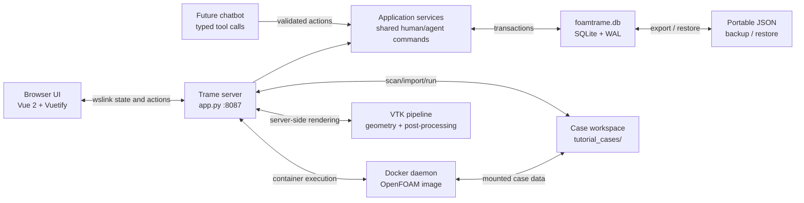

<p align="center">
  
</p>

<h1 align="center">FOAMTrame</h1>

<p align="center">
  A responsive, browser-based OpenFOAM workspace built with
  <a href="https://kitware.github.io/trame/">Trame</a>,
  <a href="https://vtk.org/">VTK</a>, and
  <a href="https://www.docker.com/">Docker</a>.
</p>

<p align="center">
  <a href="https://www.python.org/downloads/"></a>
  <a href="https://kitware.github.io/trame/"></a>
  <a href="https://www.docker.com/"></a>
  <a href="./LICENSE"></a>
</p>

FOAMTrame brings case selection, tutorial import, OpenFOAM command execution, live logs, run history, plots, and VTK post-processing into one glass-styled web interface. OpenFOAM operations run through a configured Docker image, while VTK rendering and data processing remain server-side.

## Table of contents

- [Features](#features)
- [Application workflow](#application-workflow)
- [Architecture](#architecture)
- [Requirements](#requirements)
- [Installation](#installation)
- [Running FOAMTrame](#running-foamtrame)
- [Using the application](#using-the-application)
- [App-state persistence](#app-state-persistence)
- [Backup and restore](#backup-and-restore)
- [Supported datasets](#supported-datasets)
- [Optional Flask API](#optional-flask-api)
- [Project structure](#project-structure)
- [Development checks](#development-checks)
- [Troubleshooting](#troubleshooting)
- [Security notes](#security-notes)
- [License](#license)

## Features

### Setup and case management

- Verifies the Trame server, Docker daemon, and configured OpenFOAM image.
- Scans a configurable case-root directory and restores the last active case.
- Creates a blank OpenFOAM case with `0`, `constant`, and `system` directories.
- Discovers official tutorials inside the Docker image.
- Provides searchable tutorial browsing and imports a selected tutorial into the local workspace.
- Disables active-case selection with a clear empty state when no cases exist.

Implementation: [tabs/setup_tab.py](./tabs/setup_tab.py)

### Geometry

- Loads the newest supported geometry or VTK file found in the active case.
- Accepts browser uploads for moderate-sized datasets.
- Displays dataset type, point count, and cell count.
- Uses server-side VTK rendering with camera reset and interactive controls.

Implementation: [tabs/geometry_tab.py](./tabs/geometry_tab.py)

### Meshing

- The Meshing navigation surface is currently reserved for future meshing tools.
- OpenFOAM meshing commands such as `blockMesh` are available from **Run/Log**.

Placeholder: [tabs/meshing_tab.py](./tabs/meshing_tab.py)

### Run and logs

- Detects logical and physical CPU counts.
- Configures process count and reports decomposition status.
- Runs `Allrun`, `Allclean`, `blockMesh`, `simpleFoam`, `pimpleFoam`,
  `decomposePar`, `reconstructPar`, and `foamToVTK`.
- Streams console output and supports stopping the active process.
- Retains up to 100 indexed run-history records in the application database.

Implementation: [tabs/run_log_tab.py](./tabs/run_log_tab.py)

### Plots

- Supports cached incremental updates and live full re-reads.
- Provides configurable polling and manual refresh.
- Selects scalar fields and renders scalar, velocity-magnitude, velocity-component,
  and residual charts.

Implementation: [tabs/plots_tab.py](./tabs/plots_tab.py)

### Post-processing

- Reads VTK XML and legacy datasets plus common surface formats.
- Slices along the X, Y, or Z axis.
- Clips using plane, sphere, or box controls.
- Colours data using point or cell scalar arrays.
- Applies translation, rotation, and scale transforms.
- Shows adjustable translucent source context.
- Creates streamlines from available vector arrays.

Implementation: [tabs/visualizer_tab.py](./tabs/visualizer_tab.py) and
[backend/post/postprocessor.py](./backend/post/postprocessor.py)

### Settings

- Downloads case configuration and run history as one versioned JSON backup.
- Validates uploaded backups before enabling restore.
- Applies restored configuration and history transactionally to SQLite and the live Trame state.

Implementation: [tabs/settings_tab.py](./tabs/settings_tab.py) and [app_state.py](./app_state.py). Database schema and transactions are implemented in [database.py](./database.py).

## Application workflow

1. Open **Setup** and wait for both health checks.
2. Select an existing case, create a blank case, or import an OpenFOAM tutorial.
3. Inspect available case geometry in **Geometry**.
4. Run meshing, solver, conversion, or case scripts from **Run/Log**.
5. Monitor solver data under **Plots**.
6. Inspect VTK results under **Post**.
7. Download periodic state backups from the gear-shaped **Settings** tab.

## Architecture



The primary entry point is [app.py](./app.py). It composes each tab under [tabs/](./tabs), connects backend managers under [backend/](./backend), and starts Trame on port `8087`.

### Database decision

FOAMTrame uses [SQLite](https://www.sqlite.org/) as its operational database. This is deliberate: the current application is local, single-process software, so an embedded database preserves simple installation and portable project state without requiring a database server, credentials, or another container. WAL mode, foreign keys, a busy timeout, and short-lived per-operation connections make background simulation-thread access predictable.

The database boundary lives in [database.py](./database.py), while [app_state.py](./app_state.py) retains the stable application-facing API. If FOAMTrame later becomes a hosted multi-user service or runs independent workers, that boundary should move to PostgreSQL rather than exposing SQL throughout the
UI and backend modules.

The planned chatbot should not automate browser clicks. Buttons and chatbot tools should invoke the same application-service commands. The `automation_actions` table is reserved for durable parameters, confirmation state, execution status, results, errors, and audit history; destructive or expensive commands can therefore require explicit confirmation before execution.

## Requirements

- [Python 3.10 or newer](https://www.python.org/downloads/)
- [Docker Desktop](https://www.docker.com/products/docker-desktop/) or another
  reachable Docker daemon
- A modern browser with WebSocket support
- Enough memory for the selected VTK dataset and OpenFOAM container workload

Python dependencies are pinned by compatible major version in [requirements.txt](./requirements.txt):

- Trame 3 and Trame-Vuetify 3
- VTK 9.3+
- Docker SDK for Python 7.1+
- Flask 3 and Flask-Compress
- Requests and psutil

## Installation

Clone or download the repository, then create an isolated Python environment.

### Windows PowerShell

```powershell
py -3.12 -m venv venv
.\venv\Scripts\Activate.ps1
python -m pip install --upgrade pip
python -m pip install -r requirements.txt
```

If PowerShell blocks activation, run Python directly from the environment:

```powershell
.\venv\Scripts\python.exe -m pip install -r requirements.txt
```

### Linux or macOS

```bash
python3 -m venv venv
source venv/bin/activate
python -m pip install --upgrade pip
python -m pip install -r requirements.txt
```

Make sure Docker is running and pull the default image if it is not already
available:

```bash
docker pull haldardhruv/ubuntu_noble_openfoam:v12
```

The image, OpenFOAM version, and case-root directory can be changed later under
**Setup → Advanced Settings**.

## Running FOAMTrame

Start the main Trame application:

```bash
python app.py
```

Open [http://localhost:8087](http://localhost:8087) if the browser does not open
automatically.

On Windows without environment activation:

```powershell
.\venv\Scripts\python.exe app.py
```

The wrapper below also starts the Trame process and forwards output into
`run.log`:

```bash
python run.py
```

### Load a dataset at startup

Use `--data` with a server-local supported dataset:

```bash
python app.py --data /path/to/model.vtu
```

## Using the application

### Create a blank case

1. Open **Setup**.
2. Select **Create Blank Case**.
3. Enter a case name.
4. Select **Create Case**.

The case is created below the configured `CASE_ROOT` and becomes active.

### Import an OpenFOAM tutorial

1. Wait for **Docker integration ready**.
2. Select **Import Tutorial**.
3. Search the tutorial list.
4. Select a tutorial source.
5. Select **Import Tutorial**.

Tutorial discovery and import use the configured Docker image. The tutorial is copied into the local case workspace rather than edited inside the image.

### Run a case

1. Choose an active case under **Setup**.
2. Open **Run/Log**.
3. Set the desired process count if parallel execution is required.
4. Select a command from the drawer.
5. Follow output in **Console Log Output**.

Run history records command, case, status, timestamps, and duration.

## App-state persistence

FOAMTrame stores operational application state in one embedded database:

```text
foamtrame.db
```

The database and its WAL sidecar files are excluded by
[.gitignore](./.gitignore) because they may contain machine-specific paths and local run history. SQLite stores configuration and simulation runs in relational tables; case folders, OpenFOAM result files, and large logs remain in the case workspace and are referenced by path rather than copied into database blobs.

JSON is now an interchange format only. A portable backup schema example remains available at [app_state.json.example](./app_state.json.example):

```json
{
  "version": 1,
  "case_config": {
    "CASE_ROOT": "/path/to/tutorial_cases",
    "DOCKER_IMAGE": "haldardhruv/ubuntu_noble_openfoam:v12",
    "OPENFOAM_VERSION": "12",
    "ACTIVE_CASE": "aerofoilNACA0012"
  },
  "run_history": []
}
```

Database updates use transactions. On first launch, an existing `app_state.json` is imported into SQLite; older `case_config.json` and `run_history.json` files are also supported as migration sources. Legacy files are left untouched so migration is recoverable, but SQLite becomes the source of truth once initialized.

The initial schema contains:

| Table | Responsibility |
| --- | --- |
| `schema_metadata` | Schema version and initialization markers |
| `app_config` | Typed JSON values for case root, active case, Docker image, and OpenFOAM version |
| `simulation_runs` | Indexed command, case, status, timestamps, duration, and complete compatible run record |
| `cases` | Relational case catalogue ready for workspace synchronization |
| `automation_actions` | Future chatbot/automation command queue and audit trail |

## Backup and restore

### Backup

1. Open the gear-shaped **Settings** tab.
2. Select **Backup JSON**.
3. Store `foamtrame-app-state.json` somewhere safe.

### Restore

1. Open **Settings**.
2. Choose a previously downloaded `.json` backup.
3. Wait for validation to succeed.
4. Select **Restore App State**.

Restore replaces the persisted case configuration and run history. It does **not** copy case directories, simulation results, uploaded VTK datasets, or Docker images. If a backup references a case root that does not exist on the new machine, update **Advanced Settings** after restoring.

## Supported datasets

| Extension | Dataset or surface type |
| --- | --- |
| `.vtk` | VTK legacy dataset |
| `.vtu` | XML unstructured grid |
| `.vtp` | XML polydata |
| `.vti` | XML image data |
| `.vtr` | XML rectilinear grid |
| `.vts` | XML structured grid |
| `.ply` | Polygon surface |
| `.stl` | Triangulated surface |
| `.obj` | Wavefront surface |

Parallel XML collections such as `.pvtu` are not accepted through the single-file
browser uploader because their referenced piece files must travel together.

## Optional Flask API

[flask_server.py](./flask_server.py) exposes a companion HTTP API on port `5000`. It is not required for the main Trame UI.

Start it separately when API access is needed:

```bash
python flask_server.py
```

| Method | Endpoint | Purpose |
| --- | --- | --- |
| `GET` | `/get_case_root` | Read the configured case root |
| `GET` | `/get_active_case` | Read the active case |
| `POST` | `/set_active_case` | Change the active case |
| `POST` | `/set_case` | Update case selection data |
| `GET` | `/get_docker_config` | Read Docker/OpenFOAM configuration |
| `POST` | `/set_docker_config` | Update Docker/OpenFOAM configuration |
| `GET` | `/api/cases/list` | List local cases |
| `POST` | `/api/case/create` | Create a blank case |
| `GET` | `/api/tutorials` | Discover available tutorials |
| `POST` | `/load_tutorial` | Import a tutorial |
| `GET` | `/api/case/resolve_vtk` | Resolve the newest supported case dataset |
| `GET` | `/api/startup_status` | Read backend startup status |

## Project structure

```text
.
├── app.py                    # Main Trame application and global visual system
├── app_state.py              # State API, legacy migration, JSON backup/restore
├── database.py               # SQLite schema, transactions, and repository boundary
├── app_state.json.example    # Portable state schema example
├── flask_server.py           # Optional companion HTTP API
├── run.py                    # Process wrapper and log forwarding
├── requirements.txt          # Python dependencies
├── backend/
│   ├── case/                 # Case-management helpers
│   ├── geometry/             # Geometry managers and visualization
│   ├── mesh/                 # Mesh readers and utilities
│   ├── meshing/              # OpenFOAM meshing helpers
│   ├── plots/                # Realtime/cached plotting backend
│   ├── post/                 # VTK post-processing backend
│   └── visualization/        # Shared visualization abstractions
├── static/
│   └── icons/                # FOAMTrame, Docker, and Trame assets
└── tabs/
    ├── setup_tab.py
    ├── geometry_tab.py
    ├── meshing_tab.py
    ├── run_log_tab.py
    ├── plots_tab.py
    ├── visualizer_tab.py
    └── settings_tab.py
```

Follow the links below for the principal implementation surfaces:

- [Main application](./app.py)
- [State persistence](./app_state.py)
- [Database repository and schema](./database.py)
- [UI tabs](./tabs)
- [Backend modules](./backend)
- [Static assets](./static)

## Development checks

Compile the main Python modules after making changes:

```bash
python -m py_compile \
  app.py app_state.py database.py flask_server.py \
  tabs/setup_tab.py tabs/run_log_tab.py tabs/settings_tab.py
```

Validate database initialization and the persisted state schema:

```bash
python -c "import app_state; from database import database; state = app_state.load_app_state(); print(database.path, state['version'], state.keys())"
```

For UI changes, check at least one desktop and one constrained viewport. Confirm that navigation remains reachable, cards do not overflow, and controls retain visible focus states.

## Troubleshooting

### Docker integration is not ready

- Start Docker Desktop or the Docker daemon.
- Confirm `docker version` works from the same terminal.
- Check that the configured image exists with `docker image ls`.
- Pull the default image if required.
- Verify **Setup → Advanced Settings** matches the intended OpenFOAM version.

### Tutorials keep loading or show no results

- Confirm Docker integration reports ready.
- Check that the configured image contains `/opt/openfoam<version>/etc/bashrc`.
- Re-open **Import Tutorial** to trigger a cached-state republish.
- Inspect server output for tutorial-discovery errors.

### No active cases are available

- Create or import a case under **Setup**.
- Confirm `CASE_ROOT` exists and is writable.
- Select **Refresh List** after adding a case outside the application.

### A restored active case disappears

The backup stores the case name and root path, not the case directory. Copy the case data to the restored `CASE_ROOT`, or update the root path and refresh.

### A dataset does not load

- Confirm the extension appears in [Supported datasets](#supported-datasets).
- For case auto-loading, verify the file is inside the active case directory.
- Use a server-local `--data` path for very large datasets.

### Port 8087 is already in use

Stop the existing process or change the `server.start(port=8087)` value in
[app.py](./app.py).

## Security notes

FOAMTrame can execute Docker containers and OpenFOAM commands against local case directories. **Run it only in a trusted environment**, review imported state files, and do not expose the development server directly to an untrusted network. The Settings restore flow validates structure and file size, but a restored case-root path still controls where the application reads and writes case data.

## License

FOAMTrame is licensed under the
[GNU General Public License v3.0](./LICENSE). See the repository's
[LICENSE](./LICENSE) file for the complete terms.
